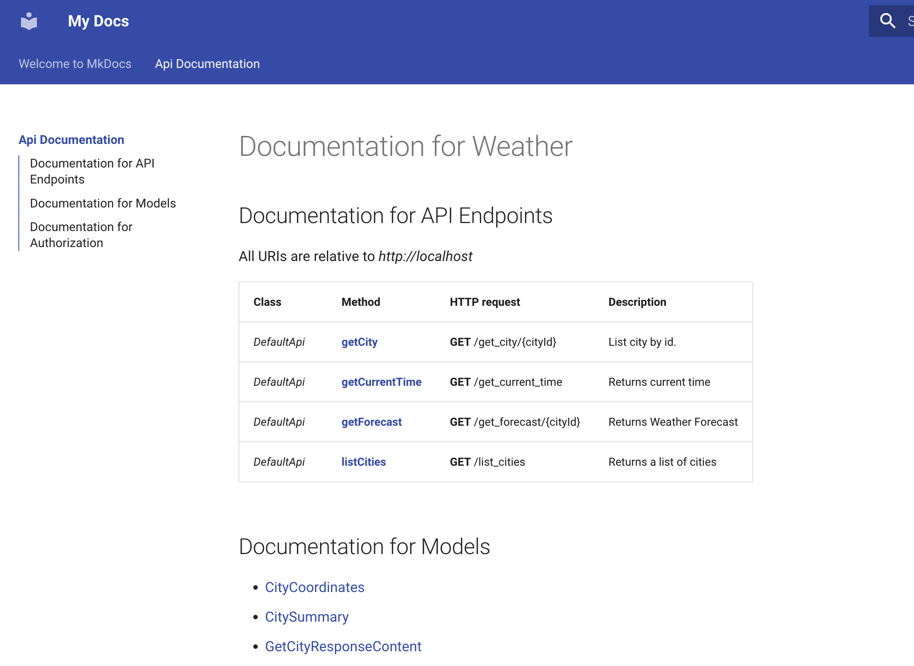

# Smithy API model to MkDocs documentation
This would produce markdown documentation in a static website from Smithy model:

Example:


## Project structure
* `MyModelPackage`:
  * `docs` -> Folder for static and generated documentation
  * `model` -> Smithy Model
  * `buildspec.yml` -> CodeBuild spec for converting Smithy to OpenApi and build into MkDocs
* `static-site-s3`:
  * CDK code for creating CodeCommit repo (for `MyModelPackage`), CodeBuild and S3 bucket.


## Use package

### Deploy infrastructure:

This will create:
* CodeCommit with name `MyModelPackage`
* S3 bucket
* CodePipeline with CodeBuild

```sh
cd static-site-s3
cdk synth && cdk deploy
```

### Upload code to `MyModelPackage`

An example of `MyModelPackage` has been included in this repository.
It contains a Smithy model, `buildspec.yml` with a minimum set of commands to perform the transformation.


Access S3 bucket to view documentation.
